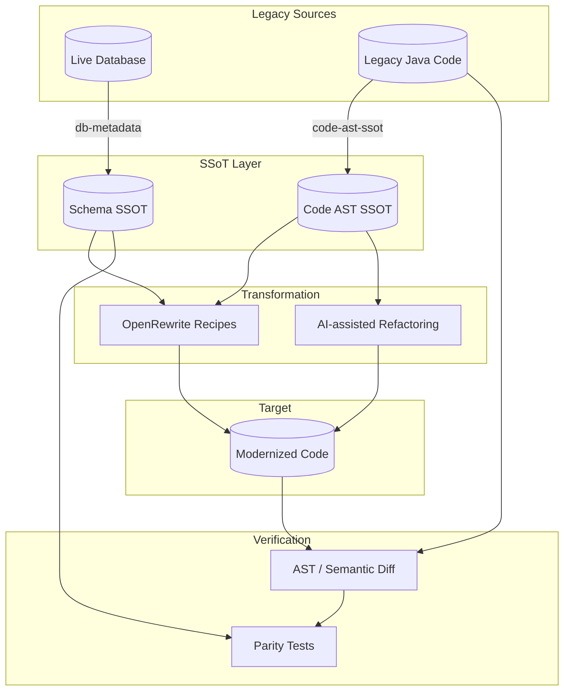

# Anchor Migration

**SSOT-driven toolkit for AI-assisted legacy modernization.**

Anchor Migration treats **database schema** and **source code AST** as single sources of truth (SSoT), applies **OpenRewrite** recipes for mechanical refactoring, and uses **AST + AI** to verify business parity between old and new code.

This program is a personal, AI-assisted architecture showcase: a composable pipeline for migrating heterogeneous legacy systems (EJB, Struts, custom patterns, and more) with verifiable outcomes.

## Repositories

| Repository | Role | Status |
|------------|------|--------|
| [**migration-hub**](https://github.com/anchor-migration/migration-hub) | Program overview, architecture, roadmap | Active |
| [**db-metadata**](https://github.com/anchor-migration/db-metadata) | Live DB → schema SSOT (SQLite) | Alpha |
| [**code-ast-ssot**](https://github.com/anchor-migration/code-ast-ssot) | Java source → code AST SSOT | Planned |
| [**rewrite-recipes**](https://github.com/anchor-migration/rewrite-recipes) | OpenRewrite rule catalog | Planned |
| [**parity-verify**](https://github.com/anchor-migration/parity-verify) | Old vs new business parity verification | Planned |
| [**pattern-catalog**](https://github.com/anchor-migration/pattern-catalog) | Migration pattern docs and examples | Planned |

## Pipeline



## Design principles

1. **SSoT first** — Schema and AST are exported from live systems, not inferred from docs.
2. **Mechanical where possible** — OpenRewrite and codemods for repeatable patterns.
3. **AI where necessary** — Ambiguous patterns, test generation, parity exploration.
4. **Verify always** — Every migration path must be checkable against ground truth.
5. **Composable tools** — Small repos, clear contracts (SQLite / JSON schemas), independent release cycles.

## Local workspace layout

```
anchor-migration/
├── migration-hub/       # this repository
├── db-metadata/         # Python CLI — schema export
├── code-ast-ssot/       # (planned)
├── rewrite-recipes/     # (planned)
├── parity-verify/       # (planned)
└── pattern-catalog/     # (planned)
```

Open `anchor-migration.code-workspace` in Cursor/VS Code to work across repos.

## Documentation

- [Architecture](docs/ARCHITECTURE.md)
- [Roadmap](docs/ROADMAP.md)
- [SSoT schema contracts](docs/SSOT-SCHEMA.md)

## Getting started

The first available tool is **db-metadata**:

```bash
cd db-metadata
pip install -e ".[all]"
db-migration export --url "..." --out metadata.db
db-migration verify metadata.db --url "..."
```

See [db-metadata README](https://github.com/anchor-migration/db-metadata).

## Contributing

Contributions welcome as the program grows. Start with [ROADMAP.md](docs/ROADMAP.md) for planned work and open issues in each repository.

## License

MIT — see LICENSE in each repository.
