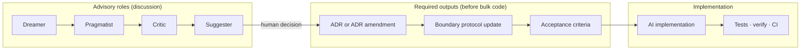

# ADR-006: Multi-role decision review before implementation

**Status:** Accepted  
**Date:** 2026-06-27  
**Context:** Anchor Migration is built **architecture-led, AI-assisted** ([DEVELOPMENT-MODEL.md](DEVELOPMENT-MODEL.md)): the human developer proposes direction; AI implements most code under boundary protocols. Discussion happens in chat and in ADRs, but a recurring failure mode appears:

- **Implementation starts before contracts lock** — code lands while SQLite schema, stable IDs, or verify rules are still implicit.
- **Chat discussion does not artifact** — good reasoning in a session is lost; the next session re-debates or assumes.
- **Single-voice optimism** — one human + one AI thread tends toward “buildable now,” under-weighting proof gaps and scope creep.

Past decisions that benefited from deeper upfront debate — core vs profiles ([ADR-002](ADR-002-java-ast-ssot-core-and-profiles.md)), AST vs LST ([ADR-003](ADR-003-ast-sidecar-vs-lst-rewrite-layer.md)), crosswalk contract ([ADR-004](ADR-004-crosswalk-contract-mapping-roles-and-edge-kinds.md)), bidirectional edge coloring ([ADR-005](ADR-005-multi-tier-alignment-and-ssot-explorer.md)) — share a pattern: **roles argued, human integrated, ADR + boundary protocol preceded bulk coding**.

This ADR formalizes that pattern as a **decision gate**, not as a replacement for deterministic quality gates (tests, `verify`, parity).

## Decision

### 1. Four review roles — advisory only

Before significant implementation, run a structured review using four **advisory personas**. They may be played by the same human, different humans, or separate AI passes — what matters is that **each lens is explicitly answered**, not that four different models are used.

| Role | Mandate | Primary questions |
|------|---------|-------------------|
| **Dreamer** | Expand the problem space; state intent and long-term fit | What user/stakeholder outcome does this unlock? How does it fit the SSOT → transform → verify chain? What future tiers/repos does it enable? |
| **Pragmatist** | Cut a shippable slice; anchor to proof | What is **v0.1** vs deferred? Can Duke's Bank (or named fixture) prove it E2E? What boundary protocol sections change? |
| **Critic** | Find failure modes and missing proof | Where can drift, silent partial success, or wrong links hide? What `verify` / test / Explorer signal catches regression? Fail-closed behavior? |
| **Suggester** | Offer alternatives without blocking | What simpler design achieves 80%? What is option B if the proposal slips? Trade-offs vs status quo? |

**Integrator / Decider:** the **human developer** only. Roles produce inputs; the human chooses, records the decision, and owns merge when gates pass.



### 2. When the gate is mandatory

**Full four-role review required** before bulk implementation when any of the following is true:

| Trigger | Examples |
|---------|----------|
| New repo or major subsystem | `anchor-explorer`, `rewrite-recipes`, `parity-verify` |
| Boundary protocol change | SSOT DDL version, stable ID format, CLI semantics, `edge_kind` |
| New profile or crosswalk semantics | `jpa`, domain/UI tier edges |
| User-visible meaning change | Explorer edge colors, mapping_role behavior |
| Security or data-handling change | New network paths, credential handling |

**Partial review (Pragmatist + Critic minimum)** for:

- Performance or refactor within existing contracts
- Bug fixes that do not change published semantics
- Docs that describe already-decided behavior

**No formal multi-role review** for:

- Typos, formatting, dependency bumps with unchanged behavior
- Test additions that only cover existing contracts

### 3. Discussion must produce artifacts

Multi-role review is **not complete** until written outputs exist. Chat alone is insufficient.

| Artifact | Owner | Content |
|----------|-------|---------|
| **ADR** (new or amended) | Human (+ AI draft) | Context, decision, consequences, rejected options |
| **Boundary protocol** | Human (+ AI draft) | Input / output / verify / error contracts per [DEVELOPMENT-MODEL.md](DEVELOPMENT-MODEL.md) |
| **Acceptance criteria** | Human | Named fixture (e.g. Duke's Bank), commands, expected counts or invariants |
| **ROADMAP / journal pointer** | Human | Phase and status update when scope is committed |

Optional: private `lab-notes/journal/` entry for session narrative; public repos must not depend on it.

#### Decision review template

Use this template in ADR drafts, PR descriptions, or journal before coding:

```markdown
## Proposal (Dreamer)
- **Goal:**
- **Non-goals:**
- **Program fit:** (which layer / repo / tier)

## Slice (Pragmatist)
- **v0.1 delivers:**
- **Deferred:**
- **Proof path:** (fixture + commands)
- **Boundary files touched:**

## Risks (Critic)
- **Failure modes:**
- **Verify / test gap:**
- **Fail-closed behavior:**

## Alternatives (Suggester)
- **Option A:** (this proposal)
- **Option B:**
- **Recommendation:**

## Decision (Human)
- **Chosen:**
- **ADR ref:**
- **Acceptance criteria:**
- **Start implementation:** Y/N
```

**Start implementation = Y** only when ADR status is at least *Accepted* (or *Proposed* with explicit human sign-off on a bounded spike) **and** acceptance criteria are named.

### 4. Relationship to AI-assisted implementation

| Phase | Who | Mode |
|-------|-----|------|
| Explore / debate | Human + advisory roles (AI may play roles sequentially) | Non-deterministic; ideas and trade-offs |
| Lock | Human | ADR + boundary protocol + acceptance criteria |
| Implement | AI under contracts | Deterministic code, tests, docs in repo |
| Prove | CI + human | pytest / JUnit / `verify` / E2E per criteria |

AI must **not** treat “user asked to build X” as permission to change SSOT contracts without an ADR path. When a request crosses a mandatory gate, **pause implementation** and complete the template first — see [AGENTS.md](../AGENTS.md).

Optional AI workflow (same session or separate passes):

1. Dreamer pass → draft Proposal section  
2. Pragmatist pass → draft Slice section  
3. Critic pass → draft Risks section  
4. Suggester pass → draft Alternatives section  
5. Human edits → Accept → then implementation prompt references ADR + acceptance criteria  

Using **separate chat threads or subagents** for Critic vs Suggester can reduce sycophancy; it is recommended for gate triggers, not required.

### 5. Post-implementation — Critic persists

After merge, the **Critic lens** remains active through:

- Parity and `verify` failures as first-class signals ([ARCHITECTURE.md](ARCHITECTURE.md) Layer 3)
- `crosswalk_issue` and red/orange edges in [anchor-explorer](https://github.com/anchor-migration/anchor-explorer) ([ADR-005](ADR-005-multi-tier-alignment-and-ssot-explorer.md))
- PR review checklist: “Does this match the ADR acceptance criteria?”

Dreamer and Suggester are **front-loaded**; Critic and Pragmatist also apply at **review and release** time.

## Consequences

### Positive

- Fewer “works in demo, wrong contract” reversals  
- ADRs capture *rejected* options, not only the winner  
- New AI sessions bootstrap from ADR + AGENTS.md instead of re-litigating  
- Aligns social process with existing deterministic gates  

### Negative / cost

- Latency before coding on gated changes — intentional  
- Role theater if personas repeat the same points without new artifacts  
- Overhead on small fixes if the gate is applied too broadly — use §2 tiers  
- Does not replace human judgment or automated proof  

### Rejected alternatives

| Alternative | Why rejected |
|-------------|--------------|
| **Always-on four-agent chat for every task** | Too slow; blurs design and implementation; no artifact discipline |
| **No process change — rely on ADRs ad hoc** | Insufficient; ADRs often written after code |
| **Committee merge without single decider** | Conflicts with architecture-led model; human owns intent |
| **Replace ADR with multi-agent consensus** | Non-deterministic; no stable contract for downstream tools |

## Implementation plan

| Step | Deliverable | Status |
|------|-------------|--------|
| 1 | Document multi-role gate (this ADR) | Done |
| 2 | Link from DEVELOPMENT-MODEL, START-HERE, AGENTS | Done |
| 3 | Use template on next gated change (`rewrite-recipes` kickoff) | ✅ ADR-007 Accepted |
| 4 | Optional: Cursor rule / skill referencing ADR-006 template | 💡 Idea |

## References

- [DEVELOPMENT-MODEL.md](DEVELOPMENT-MODEL.md) — roles, boundary protocols, quality gates  
- [ARCHITECTURE.md](ARCHITECTURE.md) — program layers and diagrams  
- [ADR-002](ADR-002-java-ast-ssot-core-and-profiles.md) — example of upfront design debate  
- [ADR-005](ADR-005-multi-tier-alignment-and-ssot-explorer.md) — Explorer as first-class interface  
- [AGENTS.md](../AGENTS.md) — AI session bootstrap and hard conventions  
