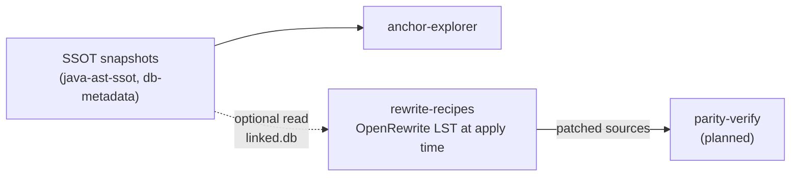

# ADR-007: rewrite-recipes kickoff — Session→Service (BeanState) vs CMP→JPA

**Status:** Accepted  
**Date:** 2026-06-27  
**Context:** Phase 2 E2E is verified: schema SSOT → code SSOT → crosswalk → [anchor-explorer](https://github.com/anchor-migration/anchor-explorer) ([DUKESBANK-DEMO.md](DUKESBANK-DEMO.md#e2e-quick-path)). Phase 3 adds **deterministic source transformation** via OpenRewrite in a new **`rewrite-recipes`** repo ([ADR-003](ADR-003-ast-sidecar-vs-lst-rewrite-layer.md): LST at transform time only; SSOT informs targeting, not stored as LST).

This ADR records the **ADR-006 four-role review** for the first rewrite slice: compare **Recipe A** (session bean → Spring `@Service`) and **Recipe B** (CMP 2.x entity → JPA `@Entity`), assess Duke's Bank as a **typical-but-simplified** CMP sample, and lock v0.1–v0.3 scope before bulk implementation.

Complements [DEVELOPMENT-MODEL.md](DEVELOPMENT-MODEL.md), [SSOT-SCHEMA.md](SSOT-SCHEMA.md) § OpenRewrite inputs, [ADR-004](ADR-004-crosswalk-contract-mapping-roles-and-edge-kinds.md), [ADR-005](ADR-005-multi-tier-alignment-and-ssot-explorer.md).

---

## Background for non–Java EE readers

This section explains **why ADR-007 rejects “just change `@Stateless` / `@Service`”** and why the **BeanState** pattern exists. No prior EJB experience required.

### EJB Session Bean vs Spring `@Service` — not the same lifecycle

| | **EJB Session Bean** | **Spring `@Service` (default)** |
|---|----------------------|----------------------------------|
| Who creates instances? | EJB container | Spring container |
| Typical scope | **Stateful:** one logical instance per client conversation · **Stateless:** pooled, no conversational fields | **Singleton:** one instance for the whole application |
| Instance fields | Stateful beans may hold **per-client** data on the instance | Fields on a singleton are **shared by all threads / all users** |

Both are called “services” in conversation, but the **instance model** differs. Swapping annotations without changing structure changes semantics silently.

### What Duke's Bank actually declares

In `ejb-jar.xml`:

| Bean | Session type | Meaning |
|------|--------------|---------|
| `AccountControllerBean`, `CustomerControllerBean`, `TxControllerBean` | **Stateful** | Container may bind **conversation state** to an instance |
| `TellerBean` (WS module) | **Stateless** | Pooled; should not keep per-user state on fields |

So the bank module’s main controllers are **not** “stateless session beans” — a recipe titled `@Stateless → @Service` does not even describe the dominant case.

### Why annotation-only migration is unsafe (AccountControllerBean)

`AccountControllerBean` keeps **instance fields** such as `LocalAccountHome`, `LocalCustomerHome`, and `LocalNextIdHome`. They are populated in `ejbCreate()` / `ejbActivate()` (JNDI lookup) and cleared on passivation.

Under EJB, those fields belong to **this controller instance** in **this client session**.

If we only add `@Service` and remove `SessionBean`:

```java
@Service  // one instance for the entire JVM
public class AccountControllerBean {
    private LocalAccountHome accountHome;  // now shared by every request
}
```

Every concurrent caller shares the same fields → **race conditions** and wrong semantics, even when methods take `accountId` as a parameter (the homes are still shared mutable instance state).

**Rejected recipe:** rename / re-annotate EJB types as `@Service` with business logic and instance fields left as-is.

**Not rejected:** migrating session **business logic** into Spring — but only with an explicit state model (BeanState below).

### Stateless is not a free pass either (TellerBean)

`TellerBean` is Stateless, but it does:

```java
AccountControllerHome home = ctx.lookup(...);
return home.create();  // creates a new Stateful controller per use
```

The **conversation** lives in the Stateful controller returned by `create()`, not in `TellerBean`. Migrating only `TellerBean` to `@Service` without redesigning this chain **breaks session boundaries**.

### Plain analogy

| Model | Analogy |
|-------|---------|
| **Stateful Session Bean** | Bank gives each customer a **personal folder**; notes inside belong to that customer |
| **Stateless Session Bean** | Clerk from a pool handles one task; **no personal folder** for the customer on the clerk’s desk |
| **Spring `@Service` singleton** | **One shared desk** for the whole branch — all customers’ notes on the same surface |

Annotation-only migration is like merging “one folder per customer” into “one shared desk” without changing the process.

### What BeanState fixes

The human-proposed pattern (§2 below):

1. Move conversational / instance fields into a plain **`BeanState`** object (inner class or POJO).
2. Pass **`BeanState`** into methods that need those fields — state travels as **parameters**, not as singleton fields.
3. Keep `@Service` **stateless** (no shared user state on fields).
4. The **caller** (web layer, filter, future REST controller) creates or loads one `BeanState` per user session — replacing the EJB container’s “one bean per conversation.”

This is more mechanical work than renaming annotations, but it preserves meaning under Spring’s default singleton scope.

### One-line summary of “explicit reject”

> **Reject:** treating `@Service` as a drop-in label for `SessionBean`.  
> **Accept:** Session logic eventually runs in Spring services, but **Stateful → BeanState + stateless `@Service`**, and Stateless callers (e.g. `TellerBean`) must be migrated with their **create/lookup** chains in mind.

---

## Multi-role review (ADR-006)

### Proposal (Dreamer)

**Goal:** Prove the **transform layer** of Anchor Migration — SSOT-guided, repeatable codemods, reviewable diffs — on Duke's Bank, then generalize to customer legacy codebases.

**Program fit:**

```
SSOT (extract) → Explorer (human review) → rewrite-recipes (transform) → parity-verify (proof)
```

**Non-goals for first release:**

- Full unmanned migration of Duke's Bank (web tier, WS, Ant build, deployment XML removal in one pass)
- Storing OpenRewrite LST in SQLite
- Recipe catalog covering every EJB variant in the industry

**Long-term:** Recipes consume **linked SSOT** (column names, `mapping_role`, edge colors) to parameterize JPA mappings and flag risky transforms ([ADR-005](ADR-005-multi-tier-alignment-and-ssot-explorer.md)).

---

### Slice (Pragmatist)

**Duke's Bank inventory (bank module):**

| Kind | Count | Examples | Descriptor |
|------|-------|----------|------------|
| **Stateful session** | 3 | `AccountControllerBean`, `CustomerControllerBean`, `TxControllerBean` | `session-type=Stateful` |
| **Stateless session** | 1 | `TellerBean` (WS module) | `session-type=Stateless` |
| **CMP 2.x entity** | 4 | `AccountBean`, `CustomerBean`, `TxBean`, `NextIdBean` | `cmp-version=2.x`, abstract accessors |

**Recommended phasing:**

| Phase | Deliverable | Repo | Proof |
|-------|-------------|------|-------|
| **3.0** | Maven + `rewrite-test` harness; smoke recipe (no-op or import cleanup) on bank sources | `rewrite-recipes` | `mvn test` green |
| **3.1a** | **CMP→JPA capability matrix** — Duke's Bank entities classified; supported vs deferred documented | `rewrite-recipes` + migration-hub | Written matrix + optional parse spike |
| **3.1b** | **Session→Service design spike** — `BeanState` pattern validated on paper + one method subset | `rewrite-recipes` | Design doc + failing→passing test on fixture |
| **3.2** | First **implemented** recipe: **Stateful session → `@Service` + `BeanState`** on `AccountControllerBean` | `rewrite-recipes` | Rewrite test snapshot + `java-ast-ssot export` diff |
| **3.3** | First **CMP→JPA** recipe: **`AccountBean` only** (scalar fields + table; defer CMR) | `rewrite-recipes` | Rewrite test + crosswalk re-link green |

**Boundary protocol (new — `rewrite-recipes`):**

| Contract | v0.1 rule |
|----------|-----------|
| **Input** | Source tree path; Java **≥17** parse level for OpenRewrite (legacy 1.4 sources parsed as historical syntax where supported); optional `linked.db` path (future) |
| **Output** | Patched `.java` files; no SSOT mutation |
| **Verify** | `rewrite-test` before/after; optional post-run `java-ast-ssot export` on touched compilation units |
| **Error** | Recipe fails closed — partial file write rolled back by test harness |

**Acceptance criteria (3.0 harness):**

- [ ] Public repo `anchor-migration/rewrite-recipes` exists with CI
- [ ] One recipe runs against `dukesbank/.../examples/bank/src` subset in Docker Maven
- [ ] Document links from [DUKESBANK-DEMO.md](DUKESBANK-DEMO.md)

---

### Risks (Critic)

**Recipe A — naive `@Stateless` → `@Service` is wrong for Duke's Bank**

- Controllers are **`Stateful`** in `ejb-jar.xml`, not stateless.
- Instance fields hold **cached `Local*Home` references** (passivated in `ejbPassivate()`), e.g. `AccountControllerBean`: `accountHome`, `customerHome`, `nextIdHome`.
- A singleton `@Service` sharing those fields across threads is **incorrect** unless state is externalized.
- `TellerBean` is stateless but **creates a new stateful controller** via `home.create()` per flow — caller/session semantics must be redesigned, not annotation-swapped.

**Recipe B — Duke's Bank CMP is “simple” but not trivial**

- **Easier than many production CMP apps:** 4 entities, explicit `jbosscmp-jdbc.xml`, 32 green crosswalk links, no BMP, no compound PK on main entities.
- **Still hard for v0.1 full automation:** CMR with **relation table** (`CUSTOMER_ACCOUNT_XREF`), **FK-style** `tx-account` role, **EJB-QL** finders, abstract CMP bean + container-generated concrete class, **local/home/remote** interface graph, `NextIdBean` sequence pattern.

**OpenRewrite / Java 1.4**

- Duke's Bank sources use Java **1.4** idioms (`ArrayList` raw types, no generics on session APIs).
- OpenRewrite runs on modern JDK; parsing may require **source level** configuration or a pre-upgrade formatting pass — must be spiked in 3.0.

**Proof gap**

- `parity-verify` does not exist yet. Until then, proof = **rewrite-test snapshots** + optional AST export diff on touched types — not behavioral equivalence.

---

### Alternatives (Suggester)

| Option | Summary | Verdict |
|--------|---------|---------|
| **A1. Annotation swap** `@Stateless` + `@Service` | Minimal diff | **Reject** — ignores stateful homes and concurrency |
| **A2. BeanState extraction** (human-proposed) | Stateful fields → inner `BeanState`; methods take `BeanState` param; `@Service` singleton stays stateless | **Accept for 3.2** — see §Decision |
| **A3. Keep session facade** | Spring `@Scope("prototype")` or per-request bean | Defer — valid for some apps; not the program's preferred teaching pattern |
| **B1. Full CMP→JPA all entities + CMR** | One big recipe | **Defer to v0.4+** — too large for first recipe |
| **B2. Scalar CMP→JPA `AccountBean` only** | `@Entity` + columns from crosswalk / XML | **Accept for 3.3** after capability matrix |
| **B3. SSOT-driven template generation** | Generate JPA from linked.db without OpenRewrite | Defer — different tool boundary; may complement recipes later |

**Recommendation:** **Parallel 3.1a + 3.1b**, then implement **A2 before B2** — session transform proves harness and threading model; CMP matrix de-risks entity recipe scope.

---

### Decision (Human)

**Chosen sequence:**

1. **3.0** — `rewrite-recipes` harness (mandatory gate output: this ADR + boundary protocol above).
2. **3.1a** — **CMP→JPA difficulty evaluation** on Duke's Bank (capability matrix § below) — *before* committing to full entity recipe scope.
3. **3.1b** — Formalize **Session→Service via `BeanState`** pattern (§ below) and spike on `AccountControllerBean`.
4. **3.2** — First production recipe: **A2** on `AccountControllerBean` (not `TellerBean`, not naive annotation swap).
5. **3.3** — First CMP recipe: **B2** `AccountBean` scalars only; CMR and EJB-QL in follow-on recipes.

**ADR ref:** ADR-007 (this document).  
**Start implementation:** **Y** for 3.0 harness after this ADR is **Accepted**; 3.2/3.3 require 3.1a/3.1b spikes complete.

---

## Decision (technical)

### 1. rewrite-recipes placement in the pipeline



- Recipes **may read** linked SSOT for column/table names in **3.3+**; not required for **3.0–3.2**.
- Recipes **must not** write SSOT files.

### 2. Recipe A — Session → `@Service` via `BeanState`

**Problem:** EJB session beans (especially **stateful**) are **container-instanced** with instance fields. Spring `@Service` defaults to **singleton** — field state is shared across threads.

**Human-proposed pattern (accepted for 3.2 direction):**

1. Identify **stateful instance fields** (exclude static, exclude `@Inject`/`@Autowired` resources if already stateless-by-design).
2. Introduce **`static` inner class `BeanState`** (or package-visible POJO) holding those fields.
3. For each instance method that reads/writes stateful fields (including methods called transitively from public API):
   - Add **`BeanState state`** as first parameter (or carry through call chain).
   - Replace field accesses with `state.field`.
4. Public API layer (future: REST/controller) **creates or loads `BeanState` per session/request** and delegates to `@Service` methods.
5. Remove `SessionBean` lifecycle methods (`ejbCreate`, `ejbActivate`, …) in a **separate recipe step** after state extraction.
6. Replace `Local*Home` lookup fields with **`@Inject` repositories / `@PersistenceContext`** in later recipes (out of 3.2 scope).

**Duke's Bank — `AccountControllerBean` field analysis:**

| Field | Stateful? | 3.2 treatment |
|-------|-----------|---------------|
| `accountId` | Declared; **unused** in method bodies (IDs passed as parameters) | Remove or move to `BeanState` if retained for compatibility |
| `accountHome`, `customerHome`, `nextIdHome` | **Yes** — set in `ejbCreate`/`ejbActivate`, cleared on passivate | **`BeanState`** in 3.2; JNDI homes remain in state until 3.4 injection recipe |
| Business methods | Mostly **stateless** given explicit `accountId` / `customerId` params | Signature change: add `BeanState` only where homes are used |

**Generality assessment:**

| Pattern | Duke's Bank | Broader legacy |
|---------|-------------|----------------|
| Cached home fields in stateful session | **Yes** (all 3 controllers) | Common pre-CDI |
| True conversational state in fields (wizard, cart) | Minimal here (`accountId` unused) | **Requires `BeanState` per user session** — pattern still applies |
| Stateless session + stateful delegate (`TellerBean`) | **Yes** | Needs **caller-side state holder**, not singleton `@Service` |

**Conclusion:** BeanState pattern is **more general** than naive `@Service` swap; Duke's Bank is a **good first fixture** but **under-represents** heavy conversational state — document as limitation in pattern-catalog later.

**3.2 recipe chain (planned):**

| Step | Recipe | Scope |
|------|--------|-------|
| A2a | `ExtractSessionBeanState` | Introduce `BeanState`, move selected fields |
| A2b | `ThreadBeanStateThroughMethods` | Add parameter to methods using state (incl. private helpers) |
| A2c | `DeclareSpringService` | `@Service` on class; remove `implements SessionBean` (last) |

Call-site updates (`home.create()` → obtain `BeanState` + service) are **out of 3.2** — web/WS tier separate recipes.

**Rejected for 3.2:** Simple `@Stateless` / `@Service` rename recipes.

### 3. Recipe B — CMP 2.x → JPA: Duke's Bank capability matrix

Evaluate **typical** Duke's Bank CMP (simpler than many production apps; harder than greenfield JPA).

#### Entity inventory

| Entity | Table | Scalar CMP fields | Relationships | EJB-QL finders |
|--------|-------|-------------------|---------------|----------------|
| `AccountBean` | `ACCOUNT` | 7 | CMR `customers` (M:N via xref) | `findByCustomerId` |
| `CustomerBean` | `CUSTOMER` | 9 | CMR `accounts` (M:N) | `findByAccountId`, `findByLastName` |
| `TxBean` | `TX` | 5 | CMR `account` (FK on `account_id`) | (in controller queries) |
| `NextIdBean` | `NEXT_ID` | 2 | none | used as sequence helper |

#### Support matrix (v0.1 recipe program)

| Capability | Duke's Bank evidence | v0.1–3.3 | Notes |
|------------|---------------------|----------|-------|
| CMP 2.x abstract accessors → JPA fields | `AccountBean` get/set pairs | **3.3 planned** | Crosswalk supplies column names |
| `@Table` / `@Column` from `jbosscmp-jdbc.xml` | All 4 entities mapped | **3.3** | Prefer linked SSOT + XML SSOT |
| String PK `@Id` | All entities | **3.3** | |
| `BigDecimal`, `Date` scalar types | Account, Tx | **3.3** | Type colors green in crosswalk |
| Remove `EntityBean` callbacks | All entities | **3.3 partial** | `ejbLoad`/`ejbStore` often empty here |
| **`@ManyToMany` + join table** | `account-customer` → `CUSTOMER_ACCOUNT_XREF` | **Deferred v0.4** | Needs schema SSOT + both sides |
| **CMR `@ManyToOne` / `@OneToMany`** | `tx-account` FK mapping | **Deferred v0.4** | `key-fields` in jbosscmp-jdbc |
| **EJB-QL → `@NamedQuery`** | 3+ queries in `ejb-jar.xml` | **Deferred** | JPQL translation separate recipe |
| **Local/Home/Remote interfaces** | Full EJB 2.x client view | **Deferred** | Interface removal is cross-cutting |
| **NextIdBean** sequence pattern | Table-backed ID | **Deferred** | Replace with `@GeneratedValue` or service |
| **Concrete bean class generation** | Container subclass of abstract bean | **Research** | OpenRewrite may target abstract `.java` only |
| BMP / compound PK / read-only entities | Not in Duke's Bank | **Out of scope** | Document as unsupported in v0.1 |
| Vendor-specific CMP extensions | JBoss DTD only | **3.3 JBoss path first** | WebLogic/WebSphere profiles later |

**Conclusion (Pragmatist + Critic):** Duke's Bank CMP is **typical for tutorial EJB 2.x** — good demo for **scalar entity migration** and crosswalk-driven columns; **production CMP apps add** read-only entities, nested CMR, BMP, finder-heavy EJB-QL, and vendor quirks — all **explicitly out of 3.3**.

**3.3 scope lock — `AccountBean` only:**

- Generate `@Entity` class (or mutate abstract bean file — spike decides) with fields matching **24 `field_maps_to_column` links** for Account.
- **Exclude** `getCustomers` / `setCustomers` CMR collection in 3.3.
- **Exclude** interface/home/local types in 3.3.

### 4. SSOT usage in recipes (phased)

| Phase | SSOT input | Usage |
|-------|------------|-------|
| 3.0–3.2 | None required | Classpath / pattern match on EJB idioms |
| 3.3 | Optional `dukesbank-linked.db` | Validate `@Column(name=…)` against `code_schema_link` targets |
| 3.4+ | Linked SSOT + schema SSOT | Drive relationship mappings, flag red edges before rewrite |

Contract extension for 3.3+: document in `rewrite-recipes/recipe.yml` metadata ([SSOT-SCHEMA.md](SSOT-SCHEMA.md) § OpenRewrite inputs).

**Language modernization** (Vector, raw collections, tuple lists → result types) is a **separate recipe family** — tiers L1/L2/L3 — see [ADR-008](ADR-008-java-language-modernization-and-tuple-lists.md). Stack recipes must not assume collections are already generified; recommended run order: **L1 → stack migration → L2/L3** where analysis allows.

### 5. Verification strategy (until parity-verify)

| Gate | Tool |
|------|------|
| Recipe correctness | OpenRewrite `RewriteTest` — before/after sources committed |
| Structural drift | `java-ast-ssot export` on changed files; diff type/method counts |
| Mapping drift (3.3+) | Re-run `crosswalk`; expect green links for migrated fields |
| Behavioral parity | **Manual / future parity-verify** — not a 3.2 gate |

---

## Consequences

### Positive

- Clear **reject** of unsafe annotation-only session migration  
- BeanState pattern captures **real Spring singleton constraint**  
- CMP matrix sets **honest expectations** for demo vs production  
- Parallel 3.1a/3.1b reduces surprise before coding either recipe  

### Negative / cost

- Session API signature changes (`BeanState` param) **cascade** to callers — multi-recipe program  
- CMP→JPA without CMR leaves **temporarily broken** relationship navigation until v0.4  
- Java 1.4 → OpenRewrite parse may need **compatibility shims**  
- Proof without parity-verify is **structural**, not behavioral  

### Rejected

- **Recipe A naive `@Service` swap** for stateful Duke's Bank controllers  
- **Full CMP→JPA in one recipe** for all 4 entities + CMR + EJB-QL  
- **LST in SSOT** (unchanged from ADR-003)  

---

## Implementation plan

| Step | Deliverable | Status |
|------|-------------|--------|
| 1 | ADR-007 four-role review (this document) | Accepted |
| 2 | Accept ADR-007; create `rewrite-recipes` repo + 3.0 harness | 📋 |
| 3 | 3.1a — CMP capability matrix doc in `rewrite-recipes/docs/` (may refine §3 above) | ✅ |
| 4 | 3.1b — BeanState spike test on `AccountControllerBean` subset | ✅ |
| 5 | 3.2 — `ExtractSessionBeanState` + `ThreadBeanStateThroughMethods` + `DeclareSpringService` + `RemoveSessionBeanLifecycle` | ✅ |
| 6 | 3.3 — `CmpScalarEntityToJpa` for `AccountBean` | 📋 |
| 7 | Update [DUKESBANK-DEMO.md](DUKESBANK-DEMO.md) Phase D (rewrite) | 📋 |

---

## References

- [ADR-003](ADR-003-ast-sidecar-vs-lst-rewrite-layer.md) — LST transform-time only  
- [ADR-004](ADR-004-crosswalk-contract-mapping-roles-and-edge-kinds.md) — `persistent_entity`, edge kinds  
- [ADR-005](ADR-005-multi-tier-alignment-and-ssot-explorer.md) — mapping quality colors  
- [ADR-006](ADR-006-multi-role-decision-review.md) — decision gate process  
- [DUKESBANK-DEMO.md](DUKESBANK-DEMO.md) — E2E extract/link runbook  
- [ROADMAP.md](ROADMAP.md) — Phase 3  

**Primary sources (Duke's Bank):**

- `AccountControllerBean.java` — stateful session, cached homes  
- `AccountBean.java` — CMP 2.x abstract entity  
- `dd/ejb/ejb-jar.xml` — Stateful vs Stateless, CMR, EJB-QL  
- `dd/ejb/jbosscmp-jdbc.xml` — table/column + relation-table mapping  
