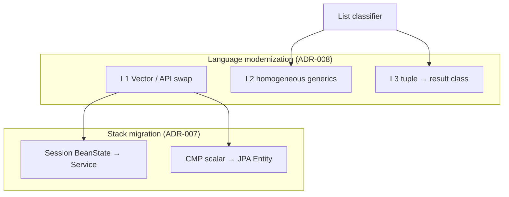

# ADR-008: Java language modernization recipes — generics and tuple lists

**Status:** Accepted  
**Date:** 2026-06-27  
**Context:** [ADR-007](ADR-007-rewrite-recipes-session-and-cmp-jpa.md) scopes **stack migration** recipes (Session→Service, CMP→JPA). Legacy codebases also need **Java language modernization**: `Vector` → collections, raw types → generics, Java 1.4 idioms → modern syntax.

A common legacy anti-pattern — especially pre-generics (Java 1.4) — is using **`List` / `Vector` as a heterogeneous tuple**: index 0 is an `int`, index 1 a `String`, index 2 a `Date`, instead of a dedicated **result class**. Mechanical `List` → `List<String>` recipes **break** this code; blind `List<Object>` **preserves** bugs but not intent.

This ADR defines a **third recipe family** in `rewrite-recipes`: **language modernization**, with **tiered automation** and SSOT-assisted classification.

Complements [ADR-007](ADR-007-rewrite-recipes-session-and-cmp-jpa.md), [java-ast-ssot](https://github.com/anchor-migration/java-ast-ssot) (usage analysis), [pattern-catalog](https://github.com/anchor-migration/pattern-catalog) (planned).

---

## Background for non–Java EE readers

### Pre-generics Java (Java 1.4 era)

Before Java 5 **generics**, collections were **raw**:

```java
ArrayList list = new ArrayList();
list.add(customerId);           // String
list.add(new Integer(42));      // Integer — different type, same list
String id = (String) list.get(0);
int n = ((Integer) list.get(1)).intValue();
```

The compiler did not track element types. Teams often abused a single `List` as a **multi-value return** when they did not want to define a small result class — a **tuple list**.

### Why this matters for recipes

| Naive modernization | What happens |
|---------------------|--------------|
| `Vector` → `ArrayList` only | Syntax update; still raw — **OK as step 1** |
| Raw `List` → `List<Object>` | Compiles; **still no type safety** |
| Raw `List` → `List<String>` everywhere | **Breaks** tuple lists (wrong types at indices) |
| Introduce `FooResult` class with fields | **Correct** for tuple lists — requires **analysis + naming** |

**Goal:** Recipes must declare a **modernization tier** and never silently pick `List<String>` when SSOT/analysis shows **heterogeneous element types**.

### Duke's Bank note

The bank module mostly uses **homogeneous** raw lists (e.g. `ArrayList` of `AccountDetails`, comments say “returns ArrayList of AccountDetails”). Tuple lists are **more common in real customer code** than in this tutorial demo — ADR-008 still applies program-wide; Duke's Bank is a weak tuple fixture but a good **L2 homogeneous** fixture.

---

## Multi-role review (ADR-006)

### Proposal (Dreamer)

**Goal:** `rewrite-recipes` offers an explicit **“modernize Java”** option alongside stack migration — safe mechanical steps by default, optional deeper refactors with human review.

**Program fit:**

```
java-ast-ssot export → classify list usage (homogeneous / tuple / unknown)
       ↓
rewrite-recipes (L1/L2/L3 modernization recipes)
       ↓
parity-verify / AST diff (structural proof)
```

**Non-goals (v1):**

- Fully automatic naming and field layout for every tuple list without human approval  
- Migrating Java 1.4 → 21 language level in one recipe  
- Replacing all DTOs with records in one pass  

---

### Slice (Pragmatist)

**Three modernization tiers:**

| Tier | Name | Examples | Automation | Human review |
|------|------|----------|------------|--------------|
| **L1** | **Mechanical API swap** | `Vector` → `ArrayList`; `Hashtable` → `HashMap`; `StringBuffer` → `StringBuilder` where thread-safe not required | **High** — OpenRewrite style recipes | Low |
| **L2** | **Homogeneous collection typing** | Raw `ArrayList` where every `add()` and `(Type) get(i)` agrees → `List<AccountDetails>` | **Medium** — needs local dataflow / cast analysis | Medium — edge cases (null, mixed via variable) |
| **L3** | **Tuple list → result type** | Same list holds `String`, `Integer`, `Date` by index → new `TransferResult` with named fields | **Low** — recipe **proposes** class + mapping; human names fields | **Required** before merge |

**Recipe metadata (each modernization recipe declares):**

```yaml
recipeFamily: language-modernization
modernizationTier: L1 | L2 | L3
requiresSsotAnalysis: false | true   # L2/L3 on list sites
failOnTupleList: true                # L2 must not run on classified tuple lists
```

**Phasing (parallel to ADR-007 — does not block 3.0 harness):**

| Phase | Deliverable |
|-------|-------------|
| **M1** | L1 recipes: `Vector` → `ArrayList`; document in pattern-catalog |
| **M2** | SSOT **list usage classifier** (see §3) — report only, no rewrite |
| **M3** | L2 recipe on Duke's Bank homogeneous lists (e.g. `getAccountsOfCustomer`) |
| **M4** | L3 spike: synthetic tuple-list fixture + proposed `*Result` class generation |

**Acceptance (M2 classifier):**

- [x] On a compilation unit, emit `list_usage` records: `homogeneous`, `tuple`, `unknown`
- [x] Tuple detection: same local list variable receives **≥2 incompatible types** from `add()` or consumed via **casts to ≥2 types** from `get(index)`

---

### Risks (Critic)

| Risk | Mitigation |
|------|------------|
| L2 infers wrong type parameter | Require all `add` sites + all cast sites agree; else **unknown** → skip L2 |
| Tuple list hidden via `list.add(x); list.add(y)` across methods | Inter-procedural analysis deferred — mark **unknown**, manual L3 |
| Index-based API `(String) row.get(3)` — field order is contract | L3 must preserve index→field mapping in generated class or `@Deprecated` index accessors |
| OpenRewrite on Java 1.4 sources | Same JDK/parse constraints as ADR-007 — may need source level 8+ **after** L1 |
| “Modernization” changes public API | Separate recipe bundle from stack migration; run order documented |

**Fail-closed:** L2 recipes **must not** apply to lists classified as **tuple**. L3 **must not** merge without human-approved class name and field names.

---

### Alternatives (Suggester)

| Option | Verdict |
|--------|---------|
| **Leave raw types forever** | Reject — blocks idiomatic Spring/JPA code |
| **Only L1, never generics** | Reject for program goals — insufficient |
| **`List<Object>` everywhere** | Reject as final state — documents failure, not modernization |
| **L3 only manual** | Accept for v1 — recipe emits **patch proposal** / IDE snippet |
| **Introduce `Object[]` instead of result class** | Reject — does not improve type safety |

---

### Decision (Human)

**Chosen:**

1. **`rewrite-recipes` exposes a `language-modernization` recipe family** with tiers **L1 / L2 / L3** (this ADR).
2. **Stack migration (ADR-007) and language modernization are separate recipe bundles** — may run in either order; recommended: **L1 before stack recipes** on same files (cleaner parse).
3. **Tuple lists → dedicated result types (L3)** — align with user direction: *what looks like a return-value list should become a return-value class*.
4. **L2/L3 depend on analysis** — extend `java-ast-ssot` or a sidecar report before applying L2 on ambiguous sites.
5. **Duke's Bank:** use for **L2 homogeneous** examples; **synthetic tuple fixture** (`TupleFixture`) validates L3 proposal/apply.

**Start implementation:** **Y** for M1/L1 after ADR-008 **Accepted**; M2 classifier before any broad L2 rollout.

---

## Decision (technical)

### 1. Tuple list anti-pattern (definition)

A **tuple list** is a local, field, or parameter-typed raw collection where **element types are not uniform** by intent:

**Signals (any combination):**

| Signal | Example |
|--------|---------|
| Mixed `add` types | `list.add(id); list.add(count);` — `String` + `int`/`Integer` |
| Mixed casts on `get` | `(String) list.get(0)` and `(Integer) list.get(1)` on same variable |
| Index constants as protocol | `ROW_ID = 0`, `ROW_STATUS = 1` with comments documenting slots |
| Return type `List` / `ArrayList` with documented heterogeneous slots | Javadoc: “0=code, 1=message, 2=payload” |

**Not a tuple list (homogeneous):**

```java
ArrayList detailsList = new ArrayList();
detailsList.add(new AccountDetails(...));  // all adds same type
```

(Duke's Bank `AccountControllerBean.copyAccountsToDetails` pattern.)

### 2. L3 target shape (result class)

For tuple list at site `list` with indices `0..n-1` and types `T0..Tn-1`:

**Generated (proposal — human edits names):**

```java
public final class OperationResult {  // name from method or human
    private final String code;       // was index 0
    private final int status;          // was index 1
    // ...
}
```

**Migration steps (recipe chain):**

1. **Introduce result class** with fields (names from comments / `ROW_*` constants / human input).
2. **Replace list construction** with `new OperationResult(...)`.
3. **Replace `get(i)` + cast** at consumers with getters.
4. **Deprecate** index accessors only if needed for transitional API.

User-proposed principle (accepted): *heterogeneous return list → return class with named fields, not `List<Object>`.*

### 3. SSOT-assisted classification (M2)

**Shipped (v0.1):** on-demand CLI `java-ast-ssot classify-lists` — ephemeral JSON report, **no SQLite sidecar, no cache** ([list-usage-classifier.md](https://github.com/anchor-migration/java-ast-ssot/blob/main/docs/list-usage-classifier.md)). Re-run when sources change.

Report record fields:

| Field | Meaning |
|-------|---------|
| `stable_id` | Site ref (`siteStableId` in JSON — method local, field, or parameter) |
| `collection_kind` | `vector`, `array_list`, `raw_list`, … |
| `usage_class` | `homogeneous`, `tuple`, `unknown` |
| `element_types` | JSON or comma-separated inferred types |
| `confidence` | `high` (all sites agree) / `heuristic` / `manual` |

**Consumers:**

- `rewrite-recipes` — skip or select L2 vs L3  
- `anchor-explorer` (future) — highlight tuple lists for review  
- `pattern-catalog` — link detection heuristics to recipes  

L2 recipe input: optional `--analysis-report` JSON from `classify-lists`; fail-closed on `tuple`.

### 4. Relationship to ADR-007



| Question | Answer |
|----------|--------|
| Same repo? | Yes — `rewrite-recipes`, different `recipeFamily` |
| Blocks 3.0 harness? | No — M1/L1 can ship after harness |
| Same OpenRewrite run? | Configurable recipe **bundle** — document order: L1 → stack → L2 → L3 |

### 5. Verification

| Tier | Proof |
|------|-------|
| L1 | `RewriteTest`; compile (target JDK) |
| L2 | RewriteTest + no remaining raw type on targeted declaration (optional Error Prone / compiler `-Xlint:unchecked`) |
| L3 | RewriteTest + human review + AST export shows new type; index `get` calls removed at site |

Behavioral parity: still **future parity-verify** — structural proof first.

---

## Consequences

### Positive

- Modernization is **first-class**, not an afterthought to EJB recipes  
- Tuple lists explicitly handled — avoids silent wrong generics  
- Tiers match automation reality (mechanical vs semantic)  
- SSOT classifier reuses extract investment  

### Negative / cost

- L3 will not be fully unattended  
- Classifier false negatives leave tuple lists vulnerable to L2 — mitigated by `failOnTupleList`  
- Extra sidecar schema / report pipeline  

---

## Implementation plan

| Step | Deliverable | Status |
|------|-------------|--------|
| 1 | ADR-008 (this document) | Accepted |
| 2 | Accept ADR-008; add `recipeFamily` convention to rewrite-recipes scaffold | ✅ |
| 3 | M1 — L1 `Vector` → `ArrayList` recipe + test | ✅ |
| 4 | M2 — list usage classifier spec + Duke's Bank report spike | ✅ |
| 5 | M3 — L2 homogeneous recipe (bank module) | ✅ |
| 6 | M4 — L3 tuple fixture + proposal-only recipe | ✅ |

---

## References

- [ADR-007](ADR-007-rewrite-recipes-session-and-cmp-jpa.md) — stack migration phasing  
- [ADR-003](ADR-003-ast-sidecar-vs-lst-rewrite-layer.md) — sidecars for extra analysis  
- [DUKESBANK-DEMO.md](DUKESBANK-DEMO.md) — homogeneous list examples in controllers  
- Java Generics tutorial — why raw types and casts were common pre-1.5  

**Tuple list (illustrative synthetic pattern):**

```java
// Legacy — tuple list as return
public ArrayList transferFunds(...) {
    ArrayList out = new ArrayList();
    out.add("OK");                    // index 0: status code
    out.add(new Integer(2001));       // index 1: tx id
    out.add(new BigDecimal("100.00")); // index 2: new balance
    return out;
}
// Target (L3) — result class
public TransferFundsResult transferFunds(...) {
    return new TransferFundsResult("OK", 2001, new BigDecimal("100.00"));
}
```
