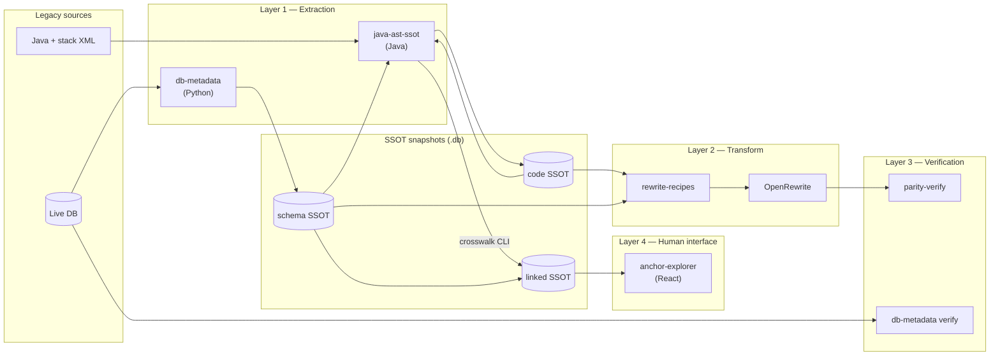
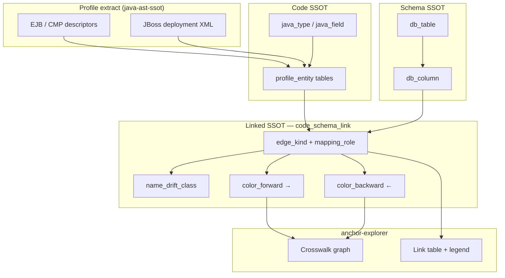
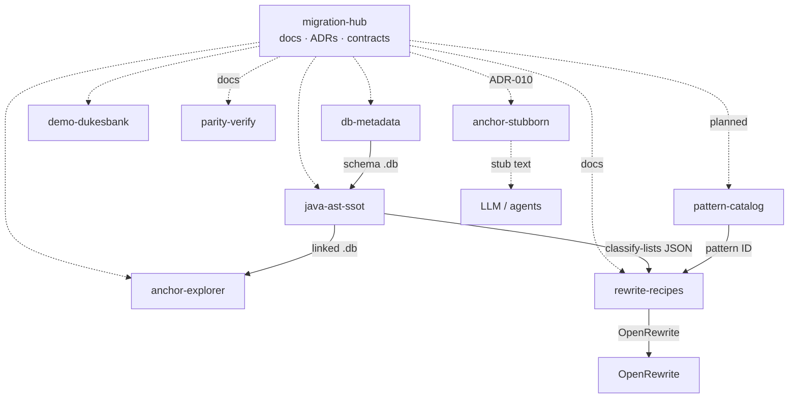
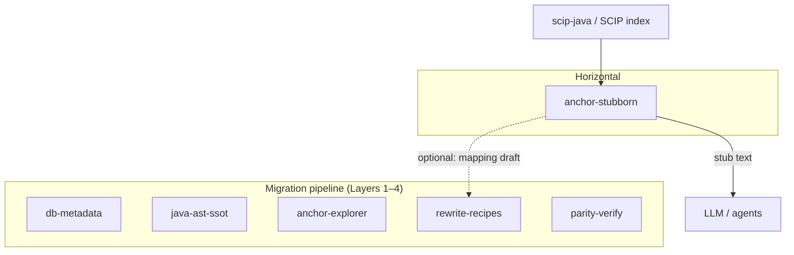
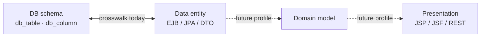

# Architecture

## Overview

Anchor Migration is a **multi-repo program** for legacy Java modernization. Each repository owns one stage of the pipeline. Shared contracts (SQLite schemas, entity key formats, pattern IDs) link the stages without tight coupling.

**Visual maps:** [Program overview](#program-overview) · [Crosswalk & alignment](#crosswalk-and-alignment) · [Repository map](#repository-map) · [Mapping tiers](#mapping-tiers)

**Process:** Significant design changes follow the multi-role decision gate — [ADR-006](ADR-006-multi-role-decision-review.md).

## Program overview

Repos are **independent**; integration is via **SQLite snapshot files**, not shared libraries.

| Stage | Repo | Input | Output |
|-------|------|-------|--------|
| Schema export | `db-metadata` | Live RDBMS | Schema SSOT SQLite |
| Code export | `java-ast-ssot` | Java tree + optional profile | Code SSOT SQLite |
| Crosswalk | `java-ast-ssot` | Code + schema SSOT | Linked SSOT (`code_schema_link`) |
| Review UI | `anchor-explorer` | Linked SSOT | Graphs, tables, edge colors |
| Rewrite | `rewrite-recipes` | SSOT + patterns | OpenRewrite recipes |
| Parity | `parity-verify` | Old + new code | Diff / test reports |

Duke's Bank (`demo-dukesbank` + external `dukesbank` sample) is the **reference E2E path** — not a boundary of any single repo.

## Crosswalk and alignment

Crosswalk links **code stable IDs** to **schema stable IDs** via stack-specific **profiles** (e.g. `javaee-ejb2-jboss`). Each edge carries **bidirectional quality colors** (ADR-005).

**Color model (traffic-map):** one direction can be green while the other is yellow — e.g. `int` → `long` is safe forward, narrowing backward. See [ADR-005](ADR-005-multi-tier-alignment-and-ssot-explorer.md).

## Repository map

Solid arrows = **artifact flow** today. Dotted = **documentation / optional** coupling via `migration-hub` contracts ([SSOT-SCHEMA.md](SSOT-SCHEMA.md)). `anchor-stubborn` is horizontal — not in Layers 1–4; see [ADR-010](ADR-010-anchor-stubborn-integration.md).

## Horizontal capabilities

Tools that serve the program (and other consumers) **without** sitting in the SSOT → rewrite → verify pipeline.

### anchor-stubborn — LLM context compiler

| Input | Tool | Output |
|-------|------|--------|
| SCIP index (e.g. `scip-java`) | `anchor-stubborn index` | Symbol graph SQLite |
| Symbol graph + target stable ID | `anchor-stubborn context` | Privacy-safe stub text (token-bounded) |
| Symbol graph + source tree | `anchor-stubborn metrics` | Compression KPI (JSON) |

**When to use:** LLM-assisted mapping design, recipe brainstorming, PR context — feed stubs instead of raw sources.  
**When not to use:** Explorer crosswalk, schema linking, OpenRewrite apply, parity diff — use pipeline tools.  
**Contract:** [ADR-010](ADR-010-anchor-stubborn-integration.md), symbol-graph DDL in [SSOT-SCHEMA.md](SSOT-SCHEMA.md).

## Mapping tiers

Long-term alignment spans four tiers (ADR-005). Phase 2.5 implements **DB ↔ data entity** edges; domain and UI tiers are future profiles.

| Tier | Example (Duke's Bank) | Status |
|------|------------------------|--------|
| DB schema | `dukesbank.ACCOUNT.BALANCE` | ✅ `db-metadata` |
| Data entity | `Account#balance` + EJB CMP | ✅ `javaee-ejb2-jboss` profile |
| Domain | Business rules layer | 💡 planned |
| Presentation | JSP / web tier | 💡 planned |

## Layers

### 1. Extraction → SSOT

| Input | Tool | Output |
|-------|------|--------|
| Live relational database | `db-metadata` | Schema SSOT (SQLite): tables, columns, PK, FK, indexes |
| Legacy Java codebase | `java-ast-ssot` | **Core:** Java AST SSOT (types, methods, fields, imports). **Optional profiles:** stack adapters (e.g. `javaee-ejb2-jboss` for EJB/XML). |

Both exporters are **read-only** on source systems and produce **versioned snapshots** suitable for drift comparison.

#### Language-specific AST repos

Extractors are named **`{language}-ast-ssot`**, not a single generic code repo. `java-ast-ssot` owns **Java source structure**; legacy **stack** details (Java EE, Spring, JPA) are **profiles** inside that repo — see [ADR-002](docs/ADR-002-java-ast-ssot-core-and-profiles.md).

Future heterogeneous migration (e.g. COBOL → Java) may add `cobol-ast-ssot`; cross-language linking is a separate layer on top of per-language SSOTs.

#### Duke's Bank

Reference **demo application**, not the boundary of `java-ast-ssot`. It validates the first profile (`javaee-ejb2-jboss`) plus `db-metadata` crosswalk.

### 2. Transformation

| Input | Tool | Output |
|-------|------|--------|
| Code SSOT + Schema SSOT + pattern ID | `rewrite-recipes` | OpenRewrite recipes tuned to detected patterns |
| On-demand list classifier (ADR-008 M2) | `java-ast-ssot classify-lists` | Ephemeral JSON (`homogeneous` / `tuple` / `unknown`) — optional gate for L2 |
| Recipes + source tree | OpenRewrite CLI / Maven plugin | Refactored source |

**Shipped recipe families (Phase 3):**

| Family | Tier | Examples |
|--------|------|----------|
| Stack migration (ADR-007) | — | Session→Service (`BeanState`), CMP→JPA scalar |
| Language modernization (ADR-008) | L1 | `Vector`→`ArrayList`, `Hashtable`→`HashMap` |
| Language modernization (ADR-008) | L2 | Homogeneous raw `ArrayList` → `ArrayList<E>` |
| Language modernization (ADR-008) | L3 | Tuple list → result class (proposal + approved apply) |
| Presets (ADR-009) | — | `DukesBankStackMigration`, `LanguageL1Only`, `LanguageL2Only`, `LanguageL3Only` |

Recommended run order on the same files: **L1 → stack migration → L2** (after `classify-lists` review for production targets).

AI-assisted refactoring handles non-mechanical cases; outputs remain subject to parity verification.

### 3. Verification

| Input | Tool | Output |
|-------|------|--------|
| Old + new codebases | `parity-verify` | Parity report: AST diffs, **`dukesbank-cmp-jpa` behavioral matrix**, HTML + JSON |
| Schema SSOT | `db-metadata verify` | Export reconciliation against live DB |

Verification is not optional in the intended workflow: migrate → verify → fix → re-verify.

### 4. Human interface — Anchor Explorer

| Input | Tool | Output |
|-------|------|--------|
| Schema + code + linked SSOT (SQLite) | **`anchor-explorer`** | Interactive graphs: schema ER, code structure, crosswalk with **edge coloring** |

Explorer is **read-only** and lives in a **separate repo**. It is not optional glue for demos: as long as humans participate in migration review, Explorer is a **first-class interface** with proper architecture and UX — see [ADR-005](docs/ADR-005-multi-tier-alignment-and-ssot-explorer.md).

Mapping quality uses **bidirectional edge colors** on each link: green/yellow/orange/red **per direction** (traffic-map model) — see [ADR-005](docs/ADR-005-multi-tier-alignment-and-ssot-explorer.md).

## Data contracts

See [SSOT-SCHEMA.md](SSOT-SCHEMA.md) for cross-repo schema versioning and entity key conventions.

### Schema SSOT (implemented)

- Repository: `db-metadata`
- Format: SQLite v1 (`export_run`, `db_table`, `db_column`, `db_foreign_key`, …)
- Stable IDs: `schema.table.column`

### Java AST SSOT (alpha — core + profiles)

- Repository: `java-ast-ssot`
- **Core format:** SQLite v1 — `export_run`, `java_type`, `java_method`, `java_field`, `java_import`
- **On-demand analysis (M2):** `classify-lists` — ephemeral JSON for raw collection sites (`homogeneous` / `tuple` / `unknown`); not stored in core SQLite — [list-usage-classifier.md](https://github.com/anchor-migration/java-ast-ssot/blob/main/docs/list-usage-classifier.md)
- **Profile (v0.1):** `javaee-ejb2-jboss` — EJB/JBoss XML tables and crosswalk edges; Duke's Bank validated
- Design: [ADR-002](ADR-002-java-ast-ssot-core-and-profiles.md) (core vs profiles), [ADR-003](ADR-003-ast-sidecar-vs-lst-rewrite-layer.md) (AST sidecars vs LST), [ADR-004](ADR-004-crosswalk-contract-mapping-roles-and-edge-kinds.md) (crosswalk)
- Stable IDs (core): e.g. `com.example.Foo#bar(int,String)`

## Pattern catalog

`pattern-catalog` documents **migration patterns** (EJB → Spring, DAO → Repository, etc.):

- Detection heuristics (AST + schema signals)
- Linked OpenRewrite recipes
- Verification checklist
- Example before/after projects

Patterns are the bridge between heterogeneous legacy code and reusable automation.

## AI-assisted development role

This organization is built with **AI as the primary coding partner**. The human developer defines architecture and [boundary protocols](DEVELOPMENT-MODEL.md); AI implements features, tests, and docs against those contracts.

See **[Development model](DEVELOPMENT-MODEL.md)** for the full operating philosophy.

### AI in the migration pipeline (building the toolkit)

- Scaffolding repos, modules, tests, and documentation
- Implementing dialect adapters, verification SQL, CLI commands
- Drafting OpenRewrite recipes and parity test matrices for human review

### AI in the product (optional, bounded)

Optional **self-healing or exploration nodes** may suggest fixes or additional tests when verification fails. These are advisory only:

- proposals become deterministic code or recipes after human approval
- the critical path (export → transform → verify) remains LLM-free at runtime

### Hard rules

AI does **not** replace SSOT or verification. Generated changes must pass mechanical checks and parity gates. Shipped code is **100% deterministic Python or Java** — reproducible, diffable, and CI-gated.

## Repository independence

Each repo has its own:

- Language / build tooling
- CI pipeline
- Release cadence

Integration is via **file artifacts** (SQLite snapshots) and documented contracts, not shared libraries (initially).

## Future considerations

- Unified CLI orchestrating export → rewrite → verify
- Additional `{language}-ast-ssot` repos for heterogeneous legacy (e.g. COBOL)
- `demo-legacy-app` sample project for end-to-end demos
- Org-level GitHub Actions for cross-repo smoke tests
