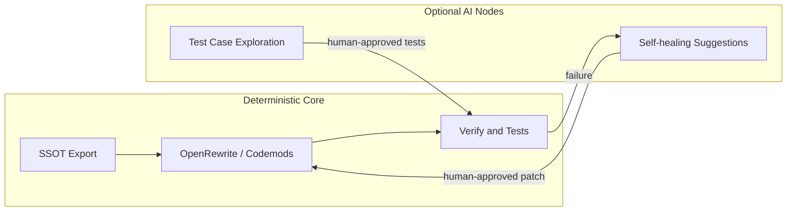

# Development Model

Anchor Migration is an **AI-assisted development** program. The organizational goal is not to ship AI as the product, but to use AI as the primary implementation engine while delivering **fully deterministic, reviewable software** in Python and Java.

## Roles

### Developer (human)

The developer is responsible for:

- **Architecture** — system boundaries, repo layout, data flow, SSOT design
- **Boundary protocols** — contracts between tools (SQLite schemas, entity key formats, CLI semantics, verification rules) co-authored and locked with AI before implementation
- **Acceptance criteria** — what “correct” means for each stage (e.g. export reconciliation, parity checks)
- **Final judgment** — merging only when deterministic gates pass

The developer does **not** need to hand-write every line of code. The developer owns **intent, structure, and proof obligations**.

### AI (implementation partner)

AI is used for:

- Scaffolding repositories, modules, tests, and documentation
- Implementing features against agreed contracts
- Refactoring, dialect adapters, SQL verification scripts, and boilerplate
- Exploring edge cases and drafting parity test matrices (bounded, human-reviewed)

AI output is always materialized as **ordinary source code** in the repo — not opaque runtime prompts.

## Deterministic deliverables

Everything shipped from this organization targets **100% deterministic execution**:

| Layer | Deterministic artifact | Language |
|-------|------------------------|----------|
| Schema extraction | `db-metadata` CLI, SQLite SSOT | Python |
| Code analysis (planned) | AST export, graph queries | Java / Python |
| Transformation (planned) | OpenRewrite recipes, codemods | Java |
| Verification | `verify` commands, AST diff, test suites | Python / Java |

Given the same inputs (source DB snapshot, source tree, recipe set, config), runs produce **reproducible outputs**. No non-deterministic behavior in the core pipeline.

## Boundary protocols

“Boundary protocol” means a **published contract** at each tool boundary:

1. **Input contract** — what the tool accepts (URL, file paths, schema version)
2. **Output contract** — schema DDL version, stable ID formats, snapshot semantics
3. **Verification contract** — how downstream tools or `verify` commands prove correctness
4. **Error contract** — fail-closed behavior; no silent partial success

Protocols are documented before bulk coding (see [SSOT-SCHEMA.md](SSOT-SCHEMA.md)) and enforced by tests — not by convention alone.

Example (implemented): `db-metadata` export → `db-migration verify` reconciliation using shared entity keys.

## AI in the migration pipeline vs AI in the product

Two distinct uses of AI:

### In the pipeline (building Anchor Migration)

AI writes and maintains the toolkit itself under human architectural direction. This is the primary mode of development for the org.

### In the product (optional, bounded)

Some nodes may use AI for **self-healing** or **assisted recovery**, for example:

- Suggesting a fix when verification reports a bounded mismatch
- Proposing additional parity cases after AST diff

These nodes, if introduced, sit **outside** the deterministic core:

Rules for optional AI nodes:

- **Never** mutate SSOT or production sources without an explicit human or deterministic recipe step
- **Never** bypass verification gates
- Outputs are proposals (patches, test lists) converted to deterministic code before merge
- Runtime migration paths remain replayable without calling an LLM

## Why this fits legacy migration

Legacy migration needs:

- **Ground truth** (schema + AST SSOT) — not guesses
- **Repeatable transforms** — OpenRewrite, not one-off edits
- **Proof** — parity verification, not “looks fine”

AI accelerates building and extending the toolchain; determinism ensures the toolchain is trustworthy in production-adjacent scenarios.

## Quality gates

Every change should satisfy:

1. **Contract** — documented and versioned if the boundary changes
2. **Tests** — pytest / JUnit; no merge on broken CI
3. **Verification** — where applicable, `verify` against live or containerized fixtures
4. **Readable diffs** — AI-generated code reviewed like any other PR

## Summary

| Question | Answer |
|----------|--------|
| Who designs the system? | Developer |
| Who writes most of the code? | AI, under contracts |
| What do users run? | Deterministic Python / Java |
| Where can AI be non-deterministic? | Optional advisory/self-healing nodes only, never on the critical path without human approval |
| What is the source of truth? | Live DB + live code, exported to SSOT — not LLM memory |

This model is the operating philosophy for all repositories under [anchor-migration](https://github.com/anchor-migration).
